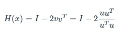
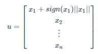
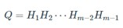

# Algorithm for QR Decomposition
## Aim:
To implement QR decomposition algorithm using the Householder reflection method.
## Equipment’s required:
1.	Hardware – PCs
2.	Anaconda – Python 3.7 Installation / Moodle-Code Runner
## Algorithm:
1.	The householder reflection is given by 

    
2.	The vector u is given by

    
3.	Q matrix can be found by taking the dot product of each successively formed Householder matrix. 

4.	Find appropriate H matrices and multiplying them from the left by the original matrix A to construct the upper triangular matrix R.

## Program:
i)	# Householder reflection method
```


```
ii)	# using np.linalg.qr
```


```
## Sample Input and Output


## Result
Thus the QR decomposition algorithm using the Householder reflection method is written and verified the result.